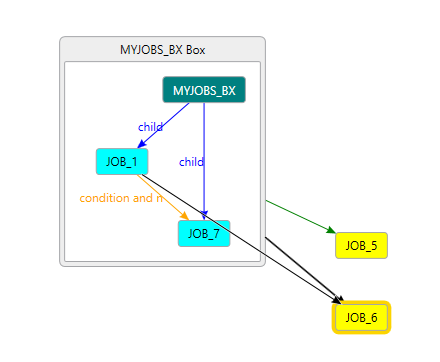

# AutoSysVisualizer
A utility for parsing through CA Autosys jil files and producing a DGML file for viewing in Visual Studio.

The generateDGML function in the jilDGML.cfc will take a given directory and parse the jil files, with the end result being a DGML file viewable in Visual Studio 2012/2017 with the DGML viewer.  Below is a simple example showing the grouping of jobs within a box with a couple of external jobs.  External jobs are defined as references to jobs that either do not have a physical jil file or are outside the filtered jobs by group.

### How To Use ###
I haven't built a gui for this, as it's still just a raw utility for me and I instantiate the object and call the method.
`dgml = createObject("component","AutoSysVisualizer.cfcs.jilDGML");`
if you only want to process specific files
`dgml.setListGroupFilter("YourGroup");`
Set the WalkFilter and It will locate that job after parsing the files, and will walk the Associated Boxs, Conditions, and Children
`dgml.setWalkFilter("JOB_NAME");`
Give it the path to your folder with the jil files and it will generate the DGML file.
`dgml.generateDGML(expandPath("../jobs"));`

### The MIT License (MIT)
Copyright (c) 2018 Christopher Wigginton

Permission is hereby granted, free of charge, to any person obtaining a copy of this software and associated documentation files (the "Software"), to deal in the Software without restriction, including without limitation the rights to use, copy, modify, merge, publish, distribute, sublicense, and/or sell copies of the Software, and to permit persons to whom the Software is furnished to do so, subject to the following conditions:

The above copyright notice and this permission notice shall be included in all copies or substantial portions of the Software.

THE SOFTWARE IS PROVIDED "AS IS", WITHOUT WARRANTY OF ANY KIND, EXPRESS OR IMPLIED, INCLUDING BUT NOT LIMITED TO THE WARRANTIES OF MERCHANTABILITY, FITNESS FOR A PARTICULAR PURPOSE AND NONINFRINGEMENT. IN NO EVENT SHALL THE AUTHORS OR COPYRIGHT HOLDERS BE LIABLE FOR ANY CLAIM, DAMAGES OR OTHER LIABILITY, WHETHER IN AN ACTION OF CONTRACT, TORT OR OTHERWISE, ARISING FROM, OUT OF OR IN CONNECTION WITH THE SOFTWARE OR THE USE OR OTHER DEALINGS IN THE SOFTWARE.

### 3rd Party Software Licenses
|Library|Source|License|
|---|---|---|
|jRegEx.cfc|https://github.com/bennadel/ColdFusion-JRegEx|[Mit License](http://www.opensource.org/licenses/mit-license.php)|
